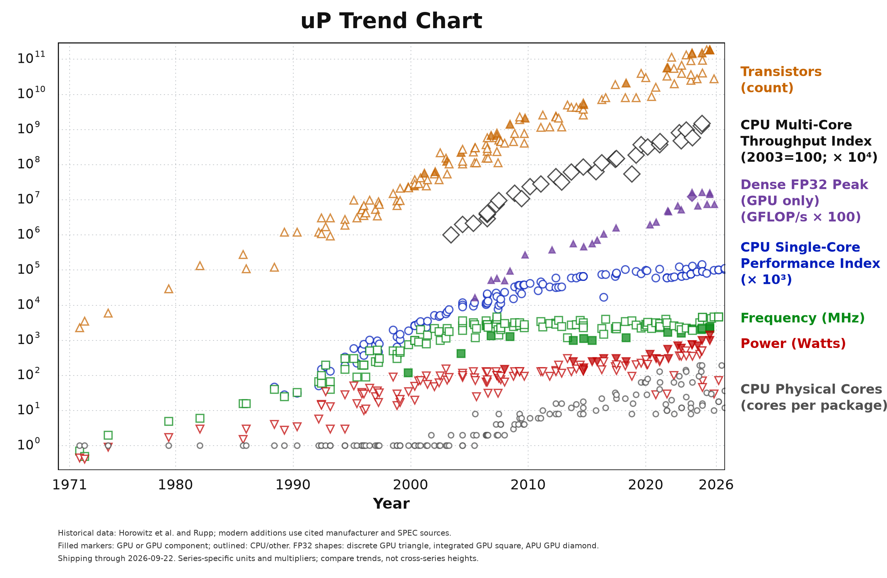

# Uptrend

The **uP Trend Chart** tracks microprocessor and GPU hardware trends using
sourced device observations. Explore the [interactive chart](https://uptrends.eelab.dev/)
or use the editable [SVG](uptrend/uptrend-chart.svg),
[PDF](uptrend/uptrend-chart.pdf), and [EPS](uptrend/uptrend-chart.eps) exports.

The [methodology](uptrend/METHODOLOGY.md) explains the data and chart scales.
`uptrend/uptrend-devices.csv`, `uptrend/uptrend-observations.csv`, and
`uptrend/uptrend-chart-data.json` are generated alongside the chart. Historical
processor inputs needed to reproduce it live in `uptrend/legacy-inputs/`.

Run [generate_uptrend.sh](generate_uptrend.sh) to rebuild the data and all chart
formats in a local Python environment. See [BUILD.md](BUILD.md) for details.

## Origin and attribution

The historical inputs derive from [Karl Rupp's Microprocessor Trend Data](https://github.com/karlrupp/microprocessor-trend-data)
and earlier work credited to M. Horowitz, F. Labonte, O. Shacham,
K. Olukotun, L. Hammond, and C. Batten.

## License

The original material and this project's additions are available under the
[Creative Commons Attribution 4.0 International license](LICENSE.txt).
Credit the contributors, link to the source and license, and indicate changes
when reusing the material.
